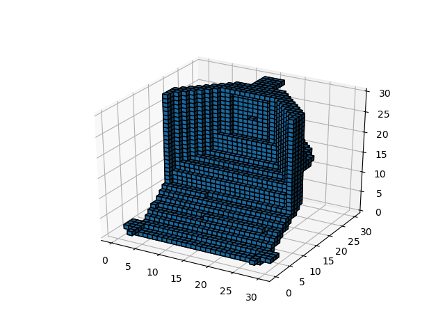

# VCONV_DAE_TF
VCONV_DAE for Tensorflow
------------------------
* Reference Paper : https://arxiv.org/abs/1604.03755
* Reference GitHub Repository(Torch & Matlab) : https://github.com/Not-IITian/VCONV-DAE

* Current Training Result of Reconstruction on ModelNet40 (30x30x30), Val_Loss(1.14E-05)
 </img> 
 </img> 
 </img> 
 </img> 

* Current Training Result of Reconstruction on KNU_Simplification (Downsampled to 30x30x30), Val_Loss (0.18)
 </img> 
 </img> 
 </img> 
 </img> 